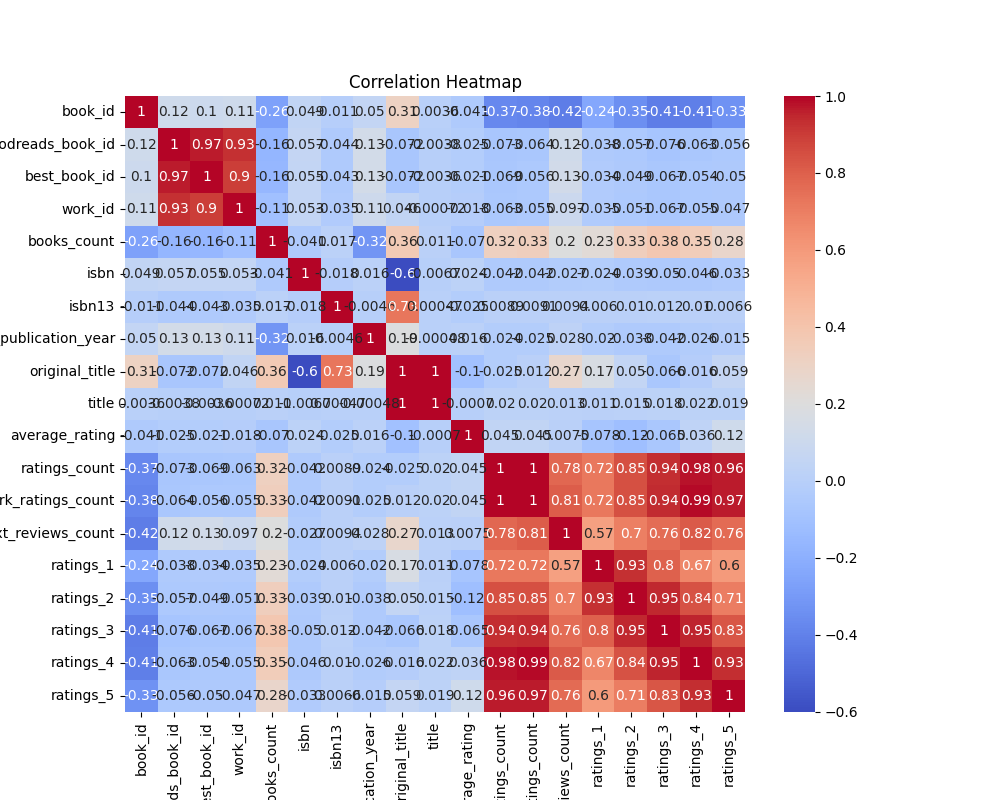

# Analysis Report

### Analysis of the Book Dataset

#### Overview
The dataset contains information about 10,000 books, including various attributes such as average ratings, ratings counts, publication details, and other relevant metrics. This analysis aims to derive insights from the dataset that can inform stakeholders, such as publishers, authors, and marketers, regarding trends and strategies for enhancing book engagement and sales.

#### Key Findings

1. **Average Rating and Ratings Count:**
   - The mean average rating across the dataset is approximately 4.00, indicating a generally positive reception of the books.
   - There is a substantial number of ratings, with an average ratings count of about 54,000 and work ratings count exceeding 59,000. These figures suggest high reader engagement and interest in the books.

2. **Publication Trends:**
   - The original publication year spans from -1750 to 2017, with a peak around 2011. This suggests a significant historical breadth, capturing both classic and contemporary literature.
   - A mean publication year of approximately 1982, combined with a standard deviation of 152 years, indicates a diverse range of publication dates with recent trends favoring contemporary works.

3. **Ratings Distribution:**
   - There is an observed trend in how ratings are distributed:
     - The lowest ratings (1-star) and the highest ratings (5-star) have the most significant count, with a notable drop-off in 2-star, 3-star, and 4-star ratings.
     - The highest number of 5-star ratings (nearly 2 million) suggests a loyal reader base, while lower numbers of 3-star ratings indicates either very good or very poor reception.
   - Imbalance in ratings can also indicate polarized opinions about the books.

4. **Correlation Insights:**
   - **Ratings and Engagement:**
     - Notably high positive correlations exist among different ratings categories (ratings_1 to ratings_5), suggesting that readers are consistent in their ratings. This correlates highly with `work_text_reviews_count`.
     - The correlation between `average_rating` and `ratings_count` (0.845) reveals that books with higher ratings tend to receive more reviews.

5. **Author and Language Data:**
   - The dataset has a single category for authors and language codes, indicating a limitation. The absence of varied author profiles and language diversity masks broader trends in reader preferences.
   - Given the frequency of 'Unknown' in both fields, it’s essential to investigate author identities and language distributions to enrich customer insights.

6. **Effect of Books Count:**
   - A negative correlation (-0.263) between books count and ratings suggests that books with fewer editions may receive higher ratings compared to those with multiple editions or sequels, potentially highlighting reader fatigue or diminishing returns in series or repeated works.

#### Implications

- **Publisher Strategy:**
  - Publishers should focus on marketing books with high engagement (as indicated by high `ratings_count`) since these have proven to perform well in terms of reader attraction and retention.
  - Analysis indicates that new releases around the 2000s to 2011 can reap benefits from targeted marketing, as this period shows a rise in positive reception.

- **Author Promotion:**
  - Given the correlations between average ratings and reader engagement, authors could leverage high-rated books to build their portfolio and get more visibility in the market.

- **Content and Readers' Preferences:**
  - The discrepancy in ratings suggests some genres or styles may be polarizing. Authors should analyze review content to understand specific issues and improve upon them in future works.

#### Recommendations

1. **Enhance Data Diversity:**
   - Future datasets should include varied author information and language data to facilitate deeper analysis of preferences across demographics.
   - It would also be helpful to categorize books by genres to learn if certain genres perform better than others in terms of ratings.

2. **Reader Engagement Campaigns:**
   - Encourage readers to provide more reviews, particularly for newer titles, as the correlation suggests higher visibility creates more engagement.
   - Initiating campaigns where readers can share their 5-star reviews on social media could leverage existing positive ratings.

3. **Evaluate Underperforming Titles:**
   - Books with a high number of 1-star ratings should undergo a review process to discover underlying issues. This could involve gathering feedback from the reader base.
   - Revisions or re-releases with a new marketing push or improvements based on reader feedback could provide opportunities for redemption.

4. **Targeted Marketing:**
   - Employ targeted marketing strategies around specific themes, years, or reader demographics, focusing on high-engagement books by leveraging their positive reception.
   - Seasonal or thematic promotions (like "best books of the 21st Century") could attract focused readerships.

### Conclusion
By examining the dataset, we uncover valuable insights about book performance, reader engagement, and strategic opportunities for stakeholders. The correlations between ratings, reader engagement, and publication years provide a roadmap for enhancing marketing strategies and improving overall book reception. Enhancing the dataset with more comprehensive details about authors and genres and implementing the above recommendations can lead to significant improvements across the board.

