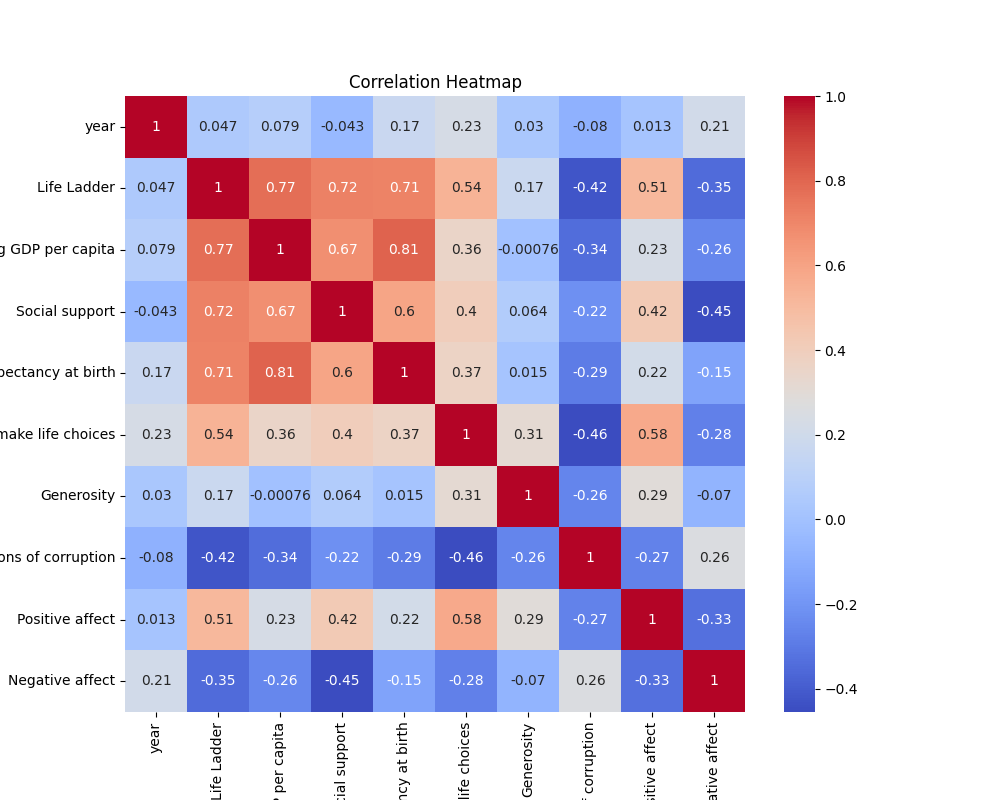

# Analysis Report

### Analysis of Well-Being Metrics Based on the Provided Dataset

#### Overview
The dataset encompasses various factors contributing to life quality, measured as "Life Ladder," which indicates overall subjective well-being among individuals across different countries over the years. The dataset comprises 2363 entries of diverse metrics that include economic indicators (e.g., Log GDP per capita), health-related factors (e.g., Healthy life expectancy), social support, perceptions of freedom and corruption, and emotional well-being indicators (e.g., Positive and Negative affects).

#### Key Insights

1. **Life Ladder and Economic Indicators**:
   - There is a robust positive correlation between "Life Ladder" and "Log GDP per capita" (correlation coefficient: 0.774). This indicates that higher economic output per capita tends to coincide with greater life satisfaction. Addressing economic disparities should be a priority for improving life satisfaction metrics.

2. **Social Support's Role**:
   - "Social support" is strongly correlated with "Life Ladder" (correlation coefficient: 0.721). This suggests that individuals who feel their social needs are met—such as having supportive family and friendships—report greater happiness. Continuing to cultivate social networks and community support systems is essential.

3. **Health Considerations**:
   - A significant relationship exists between "Healthy life expectancy at birth" and "Life Ladder" (correlation coefficient: 0.711). Improvements in health and longevity contribute to individuals’ subjective well-being. Investments in healthcare systems and preventative health measures should be prioritized.

4. **Freedom to Make Life Choices**:
   - There's a notable correlation between "Freedom to make life choices" and "Life Ladder" (correlation coefficient: 0.536). This illustrates the importance of individual autonomy in contributing to overall happiness. Policies that promote personal freedoms and choices can enhance well-being.

5. **Negative Affect**:
   - The correlation between "Negative affect" and "Life Ladder" is negative (correlation coefficient: -0.352), highlighting that increased negative emotional experiences correlate with lower life satisfaction. This indicates the need for mental health support systems to mitigate negative emotional states.

6. **Generosity and Well-Being**:
   - Surprisingly, "Generosity" shows a weak correlation with "Life Ladder" (correlation coefficient: 0.173). While generosity may not be a strong predictor on its own, it still suggests that aspects of altruism are linked to subjective well-being.

7. **Perceptions of Corruption**:
   - There is a negative correlation between perceptions of corruption and well-being indicators, including "Life Ladder" (-0.423). This suggests that higher perceptions of corruption detract from individual happiness, necessitating efforts to improve transparency and trust in governance.

#### Implications for Policy and Action

1. **Economic Development Initiatives**:
   - To foster greater life satisfaction, policymakers should focus on initiatives that stimulate economic growth, including job creation, increased educational opportunities, and equitable income distributions.

2. **Investing in Health and Social Programs**:
   - Increasing funding for public health systems and social support programs can enhance both health outcomes and social networks, leading to higher life satisfaction.

3. **Enhancing Individual Freedoms**:
   - Policies that encourage personal autonomy and freedom of choice will likely result in increased happiness levels. Advocating for individual rights and community engagement provides a strong foundation for improved life satisfaction.

4. **Mental Health Support**:
   - With the observed link between negative affect and life satisfaction, creating and funding mental health services is paramount. This includes preventive care and accessible therapies.

5. **Fostering Trust and Transparency**:
   - To combat perceptions of corruption, governments should focus on building transparency in their operations. Creating an environment of trust can lead to improved subjective well-being.

6. **Generosity Programs**:
   - While generosity appears to have a weak correlation with life satisfaction, fostering a culture of giving through community programs can enhance social connections, which in turn may promote overall well-being.

#### Recommendations for Future Research

- **Longitudinal Studies**: It would be beneficial to conduct longitudinal studies to track changes in these variables over time, elucidating the causal relationships more definitively.
  
- **Cultural Factors**: Further analysis should employ a cross-national comparison to understand cultural differences impacting these variables and the roles they play in shaping individual perceptions of life satisfaction.

- **Qualitative Research**: Supplementing quantitative data with qualitative insights could provide richer perspectives on how these factors collaboratively influence well-being.

In conclusion, this analysis reinforces the critical interconnections between economic, social, and health-related factors impacting well-being. By prioritizing these domains, stakeholders can improve the quality of life and satisfaction across populations.

