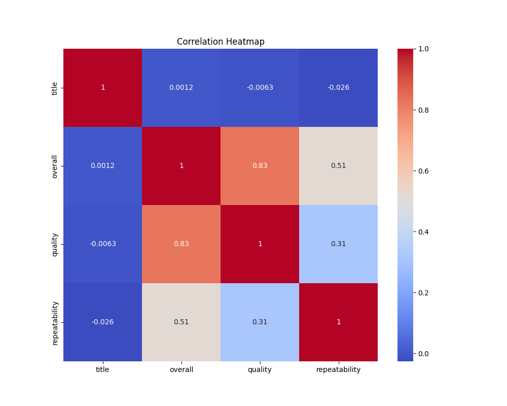

# Analysis Report

### Dataset Overview

The given dataset consists of **2,652 entries** that evaluate various aspects of a product or service through numerical ratings and categorical descriptions. The key quantitative variables include:

- **Overall Rating**: Average rating given (scale appears to be from 1 to 5).
- **Quality**: A measure of quality (also on a scale of 1 to 5).
- **Repeatability**: Indicates how likely a consumer is to repeat a purchase or recommendation, possibly on a scale of 1 to 3.

In addition to this, the dataset includes categorical variables such as **date**, **language**, **type**, and **by**, which all show uniform responses (marked as "Unknown"), indicating a lack of variability in these categories.

### Summary Statistics

1. **Overall Rating**:
   - **Mean**: 3.05, indicates that the average experience is slightly above neutral.
   - **Standard Deviation**: 0.76, reveals a moderate dispersion around the mean, suggesting that while many users rate it positively, there is significant variation in opinions.
   - **Range**: From 1 to 5, with a noteworthy number of ratings (4s and 5s) indicative of satisfaction.

2. **Quality**:
   - **Mean**: 3.21, which is again slightly positive.
   - **Correlation with Overall Rating**: Strong correlation (0.83), implying that higher quality ratings are associated with higher overall scores.

3. **Repeatability**:
   - **Mean**: 1.49 suggests that many users rate repeatability at the lowest (1).
   - The correlation with overall satisfaction is moderate at 0.51, indicating that customers' likelihood to recommend or repurchase might be tied to their overall experience but not as strongly as the quality factor.

### Analysis Insights

1. **Quality and Overall Satisfaction**:
   - The strong correlation (0.83) between **quality** and **overall rating** points to the necessity of maintaining or improving quality standards to enhance overall satisfaction.

2. **Repeatability Concerns**:
   - The low average repeatability score of 1.49 indicates that many customers may not favor repurchasing or recommending the product. This could be a potential area for improvement. Understanding the reasons behind low repeatability is crucial in amending strategies to foster loyalty.

3. **Categorical Data Uniformity**:
   - The categorical variables all being listed as “Unknown” suggests a significant gap in recorded contextual data which could lead to missed opportunities for deeper insights, such as customer demographics or purchase motivations.

### Recommendations

1. **Quality Improvement**:
   - Invest in quality enhancement initiatives to address customer feedback. Gather customer insights actively to identify specific quality issues and work on those areas to improve overall satisfaction.

2. **Enhancing Repeatability**:
   - Conduct follow-up surveys with users who rated repeatability low to understand their hesitations. Investigate whether the concerns stem from quality issues, pricing, customer service, or product expectations not being met.
   - Introduce incentives for repeat purchases, such as loyalty programs, discounts, and promotions to nurture a culture of customer retention.

3. **Data Enrichment**:
   - Collect and integrate additional metadata for each entry (e.g., customer demographics, reason for rating, detailed feedback). Implement structured collection techniques to capture this information without burdening the customer.

4. **Monitoring and Analysis**:
   - Establish a continuous monitoring system to analyze trends over time in customer ratings. Understanding how seasonal factors or marketing campaigns impact quality and overall ratings could provide actionable insights.

5. **Visualizing Customer Feedback**:
   - Develop a dashboard that visually captures customer satisfaction metrics, allowing stakeholders to assess performance at a glance. Consider integrating advanced analytics tools to derive predictive insights based on customer behavior trends.

### Conclusion

The dataset provides crucial metrics on customer satisfaction across their experiences, specifically regarding overall ratings and product quality. There are significant opportunities for enhancing the customer experience by focusing on quality improvements and repeatability strategies. A robust plan involving enriched data gathering and analytical tools will likely facilitate deeper insights and actionable adjustments for sustained engagement with customers.

